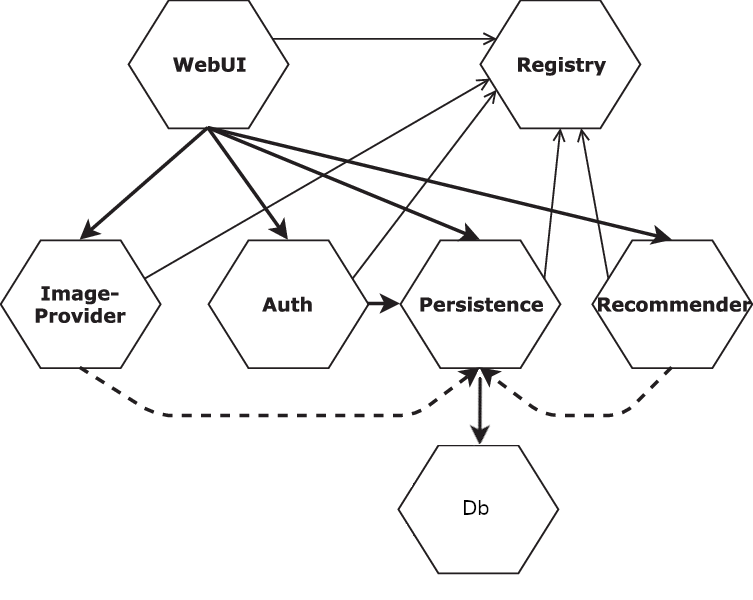
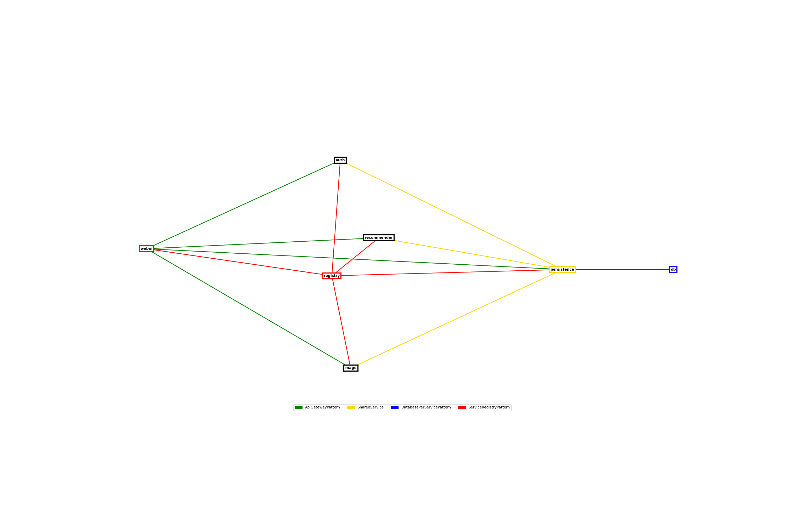

# Concern Oriented MicroService Architecture
COMSA (Concern Oriented MicroService Architecture) is an Architecture Description Language aiming at representing the architecture of microservice applications.  

Its original proposition is to represent microservice applications not as a list of microservices but through architectural structures represented as constructions of the language.  

Those constructions can be of different nature ranging from design patterns to restart policies or naming patterns. Any relevant architectural structure can be expressed through the `Concern` keyword with the most commons being already implemented in the language and ready to use.  

COMSA can be used as a deployment language as it is proposed with an associated toolbox among which compilers targeting Compose and Kubernetes.  

The aim is to drastically reduce redundancy and increase understandability of the application compared to other deployment and architecture description languages.

## Table of Contents

- [Installation and Usage](#installation-and-usage)
  - [Docker](#docker)
- [Motivating Example](#Motivating_Example)
  - [Teastore Application: Compose](#teastore-application-compose)
  - [Teastore Application: COMSA](#teastore-application-comsa)
- [Syntax](#Syntax)
  - [File Schema](#file-schema)
  - [Concern Keyword](#concern-keyword)
- [Library of Concerns](#library-of-concerns)
  - [Property Centric Concerns](#property-centric-concerns)
  - [Architecture Patterns](#architecture-patterns)
  - [Behaviors and Implicit Properties](#behaviors-and-implicit-properties)
- [Toolbox](#Toolbox)
  - [Compilers](#Compilers)
  - [Visualization](#Visualization)
  - [Analysis](#Analysis)
- [Dataset](#Dataset)
- [Documentation](#Documentation)
- [References](#References)

## Installation and Usage

The COMSA language is accompanied by a toolbox described in the [Toolbox](#Toolbox) section. This section presents the different ways to install and use it.
The `comsatools` executable is a python script through which all the COMSA tools are executed.

### Docker
The easiest way to use the toolbox is through docker.  
This can be done by either building the image from the git repository:
```bash
git clone https://github.com/hmonfleur/comsa.git
cd comsa
docker build -r comsatools -f Dockerfile .
```

Or by pulling the image from DockerHub:
```bash
docker pull hmonfleur/comsatools:latest
# Renaming the image for shortness and consistency in upcoming descriptions
docker tag hmonfleur/comsatools:latest comsatools
```

`comsatools` can now be used through the following command which display the result in the terminal:
```bash
docker run --rm -v /path/to/local/folder:/shared comsatools <toolname> <filename>
```

Using `comsatools` as a Docker image requires to share a folder with the container in which the processed files are put in. The name of the file only is required to pass it to the `comsatools` executable, not the full path.  
For instance the following command will output the translation of `myapp.comsa` in a deployable Docker Compose description :
```bash
cp myapp.comsa /tmp
docker run --rm -v /tmp:/shared comsatools comsa2compose-yaml myapp.comsa
```

Saving the ouput in a file can be done through redirection:
```bash
docker run --rm -v /tmp:/shared comsatools comsa2compose-yaml myapp.comsa > myfolder/myapp.comsa
```

Or by passing the `-o` argument and a new filename that will be created in the shared folder.
The command:
```bash
docker run --rm -v /tmp:/shared comsatools comsa2compose-yaml myapp.comsa -o myapp.yaml
```
Will create a Docker Compose file from the COMSA description of myapp and save it in `/tmp` on the host machine.

## Python venv


## Motivating Example

### Teastore application: Compose

The [Teastore microservice application][teastore-github] topology can be represented through the following graph:  

  
Patterns can be assumed from the names of the microservices and the links represented in the image. However this image documentation is not a necessity and the application architecture is hardly understandable from its Compose description:  

```yaml
version: '3'
services:
  registry:
    image: descartesresearch/teastore-registry
    expose:
      - "8080"
  db:
    image: descartesresearch/teastore-db
    expose:
      - "3306"
    ports:
      - "3306:3306"
  persistence:
    image: descartesresearch/teastore-persistence
    expose:
      - "8080"
    environment:
      HOST_NAME: "persistence"
      REGISTRY_HOST: "registry"
      DB_HOST: "db"
      DB_PORT: "3306"
  auth:
    image: descartesresearch/teastore-auth
    expose:
      - "8080"
    environment:
      HOST_NAME: "auth"
      REGISTRY_HOST: "registry"
  image:
    image: descartesresearch/teastore-image
    expose:
      - "8080"
    environment:
      HOST_NAME: "image"
      REGISTRY_HOST: "registry"
  recommender:
    image: descartesresearch/teastore-recommender
    expose:
      - "8080"
    environment:
      HOST_NAME: "recommender"
      REGISTRY_HOST: "registry"
  webui:
    image: descartesresearch/teastore-webui
    expose:
      - "8080"
    environment:
      HOST_NAME: "webui"
      REGISTRY_HOST: "registry"
    ports:
      - "8080:8080"
```

### Teastore Application: COMSA

COMSA proposes to have the architecture at the frontend of the description so that it's understandable at first glance:

```pkl
const DB_PORT = "3306"
const REGISTRY_PORT = "8080"
const BusinessServices = Set("persistence", "auth", "image", "recommender", "webui")

version = "3"
concerns {

  ["WebUI"]
    = new ApiGatewayPattern {
        msid = "webui"
        sids = Set("persistence", "auth", "image", "recommender")
      }

  ["Registry"]
    = new ServiceRegistryPattern {
        msid = "registry"
        sids = BusinessServices
        service_template {
          environment {
            ["REGISTRY_HOST"] = msid
            ["REGISTRY_PORT"] = REGISTRY_PORT
            ["HOST_NAME"] = "{SID}"
          }
        }
        services {
          [BusinessServices + Set("registry")] {
            expose {
              REGISTRY_PORT
            }
          }
        }
      }

  ["Database Per Service Pattern"]
    = new DatabasePerServicePattern {
        msid = "db"
        main_service_template {
          expose {
            DB_PORT
          }
        }
        sid = "persistence"
        service {
          environment {
            ["DB_HOST"] = msid 
            ["DB_PORT"] = DB_PORT
          }
        }
      }

  ["Persistence"]
    = new SharedService {
        msid = "persistence"
        csids = Set("image", "recommender", "auth")
      }

  ["DescartesresearchTeastore Images"]
    = new ImageConcern {
        sids = BusinessServices + Set("registry", "db")
        image = "descartesresearch/teastore-{SID}"
    }

  ["Public Ports"]
    = new PublicPortsConcern {
        ports {
          ["webui"] { "REGISTRY_PORT:REGISTRY_PORT" }
          ["db"] { "DB_PORT:DB_PORT" }
        }
      }
}
```

Without going into the COMSA specific synta we can point out that the application structure is now explicit not only because of the custom identifiers of the structures but because of the classes used to define the application.  
Moreover the redundancy has disapeared from the application so when we modify a value we do it for all the related microservices instead of having to repeat the operation and risk to forget some or do some text replacement and possibly modify more than we wanted.  
Actually the description contains more than before as when compile to Compose, implicit properties implied by the patterns will be injected.  

We can generate the application topology using the toolbox which gives us a view based on the description:


## Syntax
The COMSA language is based on [Pkl][pkl-website]. Even though COMSA is meant to be used declaratively, all of [Pkl language features](https://pkl-lang.org/main/current/language-reference/index.html) (ex: functions) and [Pkl standard library](https://pkl-lang.org/package-docs/pkl/0.29.0/) can be used in COMSA descriptions.

### File Schema

A `.comsa` file describing a microservice application has the following schema:

```pkl
concerns {
// Concerns are defined here
}

services {
// services with properties not included in a concern can be defined here
}
```

### Concern Keyword
A Concern is a object linking sets of services with sets of properties. The following presents a COMSA file with one concern, named `MyConcern`, assigning, by declaring relations in the concern `services` section, an open port to `service1`  and setting for three microservices the `image` value with a function concatenating the string `"myrepo"` and the service identifier, referred to by using the keyword `module.SID`.

```pkl
concerns {
  ["MyConcern"]
  = new Concern {
    services {

      ["service1"] {
        ports { 8080 }
      }

      ["service3"] {
        ports { 3306 }
      }
  
      [Set("service1", "service2", "service3")] {
        image = "myrepo_" + module.SID
      }
  
    }
  }
}
```

Services are declared simply by being part of a `Concern` object, they do not need to be referenced elsewhere to exist.  
Each relation between a set of services and a set of properties define partially the contained services that can appear in any number of `Concern` objects. The service total definition is the aggregation of all its associated properties in the file which is done by to [compilers](#Compilers) when producing a deployable Compose or Kubernetes file.  

Using the `comsa2compose-yaml` tool presented in the [Compilers](#Compilers) section  with the command :
```bash
comsatools comsa2compose-yaml /path/to/file.comsa
```
we obtain the following file which is immediately deployable using Docker-Compose:

```yaml
services:
  service1:
    image: myrepo_service1
    ports:
    - 8080
  service2:
    image: myrepo_service2
  service3:
    image: myrepo_service3
    ports:
    - 3306
```

We have successfully removed some redundancy but, to operate the separation of concerns, a better `.comsa` file would be:  

```pkl
concerns {

  ["ImageConcern"]
    = new Concern {
      services {
        [Set("service1", "service2", "service3")] {
          image = "myrepo_" + module.SID
        }
      }
    }

  ["OpenPortsConcern"]
    = new Concern {
      services {
        ["service1"] {
          ports { 8080 }
        }
        ["service3"] {
          ports { 3306 }
        }
      }
    }
}
```

Here the different Concerns of the application are properly distinguished, the shared properties are effectively unified thus leaving no redundancy and not necessitating multiple edits on modification. Using the command specified earlier, it produces the same output.

## Library of Concerns
The previous example provides the core idea of the COMSA language, allowing any relevant grouping of properties, making the architecture explicit and removing unnecessary scattering of properties.  
However it still relies on `Concern` identifier to transmit rapidly the idea of the structure of the application. To standardize and simplify the description, we implemented a library of `Concern` objects described in the [COMSA Library Documentation][comsa-documentation].  

### Property Centric Concerns

Using it we can propose a new version of the previous example:  

```pkl
const AllServices = Set("service1", "service2", "service3")
concerns {

  ["ImageNamingPattern"]
    = new ImageConcern {
      sids = AllServices
      image = "myrepo_" + module.SID
    }

  ["OpenPorts"]
  = new PublicPortsConcern {
    ports {
      ["service1"] { 8080 }
      ["service3"] { 3306 }
    }
  }

}
```

First note that using Pkl syntax we declared a constant `AllServices` whose value is a set containing all the services of the application. In the same way functions can be defined outside of the `concerns` code block and used in it.  
The `AllService` constant is the used in the declared `ImageConcern` that contain by design a specific image pattern assigned to a number of services.  The other specific pattern is a `PublicPortConcern` whose function is to gather the sensitive information of entrypoints in the application.  
Those two concerns are **property centric patterns** who are meant to express configuration viewpoints on the application. While the application could be functional with the minimal information we provided, the topology has not been expressed yet.  

### Architecture Patterns
To express the topology of the application we use another kind of `Concern` objects from the COMSA Library, `MicroserviceArchitecturePattern`, that implement design patterns.  
Those concerns are **service centric** in the sense that they are build around a technical (or infrastructural) service and a set of other services that are in relation with it.  
Using them we propose a different description of the same application :

```pkl
const AllServices = Set("service1", "service2", "service3")

concerns {
  ["Frontend"]
    = new ApiGatewayPattern {
      msid = "service1"
      sids = "service2"
      main_service {
        ports { 8080 }
      }
    }

  ["DedicatedDatabase"]
    = new DatabasePerServicePattern {
      msid = "service3"
      sids = "service2"
      main_service {
        ports { 3306 }
      }
    }


  ["ImageNamingPattern"]
    = new ImageConcern {
      sids = AllServices
      image = "myrepo_" + module.SID
    }
}
```

The application topology is then made clear in a simple text description that also serves as a deployment file. Indeed, compiling toward Docker Compose, we obtain the following file :

```pkl
services:
  service1:
    depends_on:
      service2:
        condition: service_started
    ports:
    - 8080
  service2:
    depends_on:
      service3:
        condition: service_started
  service3:
    ports:
    - 3306
```

Note that some properties were added at compile time. This is because based on the default pattern behavior, we can deduce properties while keeping them implicit in the description.  

### Behaviors and Implicit Dependencies

As specific situation may require not to use the default pattern behavior, this feature can be overrode using the `behaviors` attribute of `MicroserviceArchitecturePattern`.

For instance if we want not to have the front end, `service1`, depend the business service `service2`, we can modify the previous description as following:

```pkl
const AllServices = Set("service1", "service2", "service3")

concerns {
  ["Frontend"]
    = new ApiGatewayPattern {
      behaviors = null
      msid = "service1"
      sids = "service2"
      main_service {
        ports { 8080 }
      }
    }

  ["DedicatedDatabase"]
    = new DatabasePerServicePattern {
      msid = "service3"
      sids = "service2"
      main_service {
        ports { 3306 }
      }
    }


  ["ImageNamingPattern"]
    = new ImageConcern {
      sids = AllServices
      image = "myrepo_" + module.SID
    }
}
```

Compiling the file to Docker Compose then removes the dependency:
```yaml
services:
  service1:
    ports:
    - 8080
  service2:
    depends_on:
      service3:
        condition: service_started
  service3:
    ports:
    - 3306
```

Behavior can also be added using `behavior {*additional_behavior*}` or overrode using another behavior using `behavior = new Listing{*replacement_behavior*}`.  
At the time of writing the COMSA language implements the following behaviors:
- sids_depends_on_msid              (or sids_depend_on_msid)
- sids_depends_on_started_msid      (or sids_depend_on_started_msid)
- sids_depends_on_healthy_msid      (or sids_depend_on_healthy_msid)
- msid_depends_on_sids
- msid_depends_on_started_sids
- msid_depends_on_healthy_sids
- sids_connect_to_msid
- msid_connect_to_sids              (or msid_connects_to_sids)


## Toolbox
The `comsatools` executable gathers all the tools associated with the COMSA language. Its usage is done through the following schema:
```bash
./comsatools TOOL FILE [OPTION...]
```

Using the `-o /path/to/output` option write the output in the file located at `/path/to/output`. Without the option it is displayed on stdout.  

The commands presented in this section use the `comsatools` executable. The Docker image usage is largely identical but requires using `docker run` and sharing a folder with the container. Please refer to the [Docker](#docker) section.

### Compilers
#### comsa2compose-yaml
Produces an executable Docker Compose YAML file from a COMSA description.  
Example:
```bash
./comsatool comsa2compose-yaml dataset/teastore.comsa -o /tmp/teastore.yaml
```

#### comsa2k8s
Produces an executable Kubernetes YAML manifest from a COMSA description.  
Example:
```bash
./comsatool comsa2k8s dataset/teastore.comsa -o /tmp/teastore.manifest.yaml
```
### Visualization
#### topology
Produces a png file of the graph representing the topology of the application base on the architectural patterns present in a COMSA description.
Example:
```bash
./comsatool topology dataset/teastore.comsa -o /tmp/teastore.topology.png
```
Note that if the `-o` option is omitted, the tool still saves a png file with a default name base onthe source file.

#### hypergraph-policies
Produces a png file of the hypergraph representing the policies of the application base on the property centric patterns present in a COMSA description.
Example:
```bash
./comsatool hypergraph-policies dataset/teastore.comsa -o /tmp/teastore.policies.png
```
Note that if the `-o` option is omitted, the tool still saves a png file with a default name base onthe source file.

#### hypergraph
Produces a png file of the graph representing the extension of all the concerns in the application COMSA description.
Example:
```bash
./comsatool hypergraph dataset/teastore.comsa -o /tmp/teastore.hypergraph.png
```
Note that if the `-o` option is omitted, the tool still saves a png file with a default name base onthe source file.

### Analysis
#### comsa-analysis
Provides informations and warnings about the patterns used in the application description.  
Example:
```bash
./comsatool comsa-analysis dataset/teastore.comsa
```

#### comsa-metrics
Provides metrics about the patterns used in the application description.  
Example:
```bash
./comsatool comsa-metrics dataset/teastore.comsa
```

#### comsa-check
Provides informations and warnings about the services referred to in the application description.
Example:  
```bash
./comsatool comsa-check dataset/teastore.comsa
```

#### comsa-tangling
Shows the tangling level for services in an application COMSA description, i.e., the degree to which a service is part of multiple concerns.
Example:  
```bash
./comsatool comsa-tangling dataset/teastore.comsa
```

#### comsa-scattering
Shows the concern scattering level for an application, i.e., how spread a concern is among services.
Example:  
```bash
./comsatool comsa-type dataset/teastore.comsa
```

#### comsa-type-scattering
Shows the concern type scattering level, i.e., how wide a concern type is spread in the application.
Example:  
```bash
./comsatool comsa-type-scattering dataset/teastore.comsa
```

## Dataset and Results
We provide a 21 COMSA real application descriptions in the `dataset` folder. Those applications were mainly selected in [Davide Taibi's curated list of Open Source projects developed with a microservice architectural style](https://github.com/davidetaibi/Microservices_Project_List) to which we added three of the [Deathstarbench applications](https://github.com/delimitrou/DeathStarBench). The COMSA descriptions are the files with a `.comsa` extension while the `.yaml` files are the original Compose description.  

Aiming toward architectural clarity, we provide various ways of using the COMSA language, some limited to the declarative use of patterns, other making use of the functional capabilities provided by its [Pkl][pkl-website] backend.

## Documentation
The library of implemented concerns is available on the github pages of the present repository at [https://hmonfleur.github.io/comsa/].

## References
[teastore-github]: https://github.com/DescartesResearch/TeaStore
[pkl-website]: https://pkl-lang.org/
[comsa-documentation]: https://hmonfleur.github.io/comsa/
